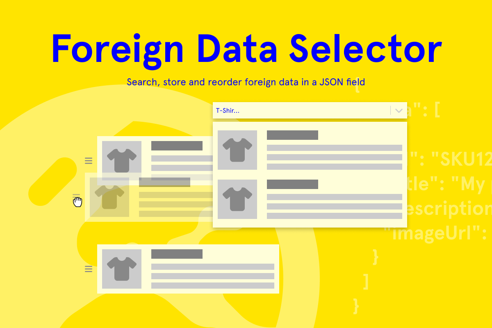

# DatoCMS Plugin: Foreign Data Selector
A DatoCMS plugin that enables you to search external APIs and store selected results as structured JSON data. Perfect for integrating third-party data sources like product catalogs, user directories, or any external service that provides JSON responses.



## ✨ Features
- **Universal API Integration**: Connect to any external API that returns JSON data
- **Intelligent Search**: Dynamic search functionality with customizable query parameters
- **Flexible Authentication**: Add custom headers for API keys, bearer tokens, or other authentication methods
- **Visual Data Management**: Drag-and-drop interface to reorder stored items
- **Smart Data Mapping**: Use JSONPath notation to extract exactly the data you need from API responses
- **Configurable Limits**: Set minimum and maximum item counts to control data volume
- **Rich Preview**: Display titles, descriptions, and images for each selected item

Transform any JSON API into a searchable, manageable data source within your DatoCMS workflow.

## 📋 Setup & Usage

### Installation
Add this plugin via DatoCMS Settings > Plugins > Add (`/admin/plugins/new`).

### Enabling on a Field
1. Navigate to your model settings in DatoCMS
2. Select the JSON field you want to enhance
3. In the Presentation tab, select "Foreign Data Selector" from the Field Editor dropdown
4. Save your changes

### Configuration Options

**API Configuration:**
- **Search URL**: Enter your API endpoint with `{query}` placeholder (e.g., `https://api.example.com/search?q={query}`)
- **Headers**: Add custom headers for authentication or API requirements
- **Min/Max Items**: Set limits for the number of items that can be selected

**Data Mapping:**
- **Response Path**: JSONPath expression to locate the data array in the API response
- **ID Field**: Map to the unique identifier field from the API
- **Title Field**: Map to the display title/name field from the API
- **Description Field**: Optional mapping for item descriptions
- **Image URL Field**: Optional mapping for item images

**Preview**: View the expected API response structure in the readonly field

### Data Output
Stores selected items as a JSON array with your mapped field structure:
```json
{
 "data": [
   {
     "id": "SKU12345",
     "title": "Product Name",
     "description": "Product description",
     "imageUrl": "https://example.com/image.jpg"
   }
 ]
}
```

## 👥 Contributing
See [contributing.md](https://github.com/voorhoede/datocms-plugin-foreign-data-selector/blob/main/contributing.md).
